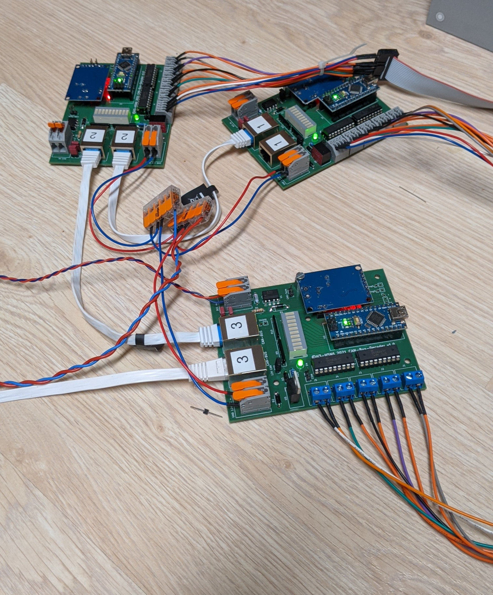
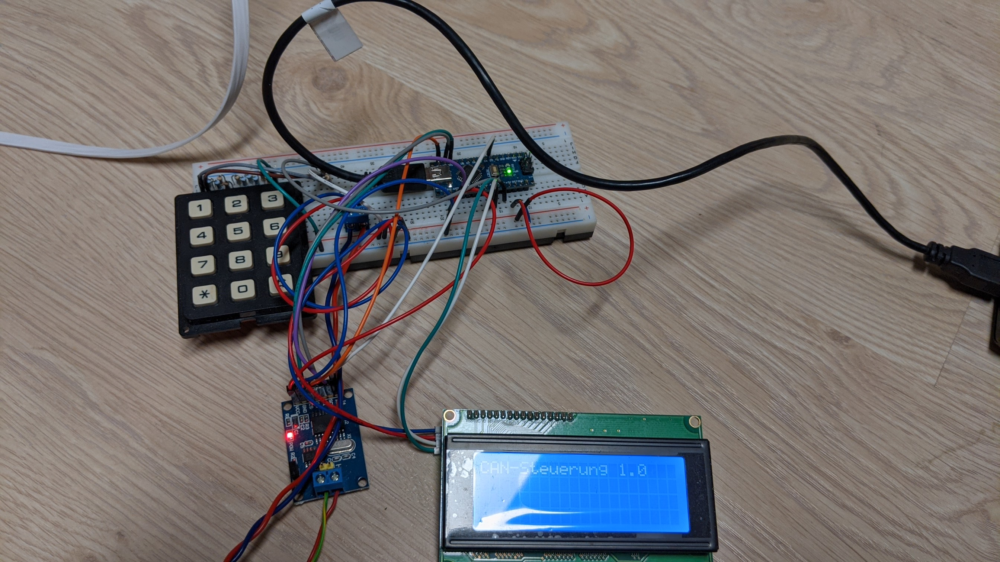
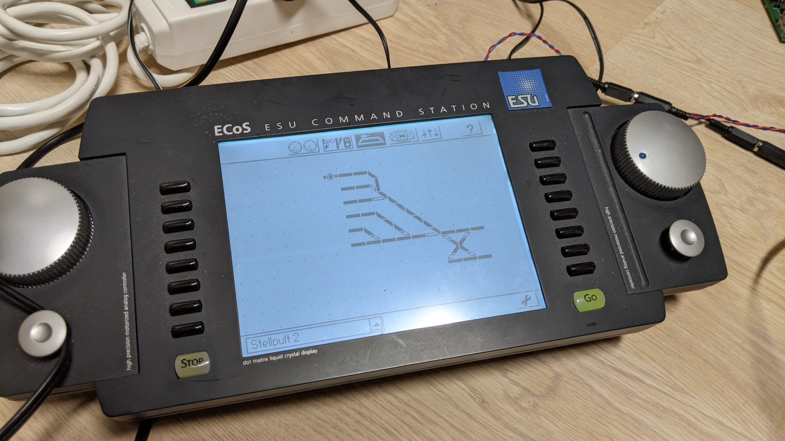
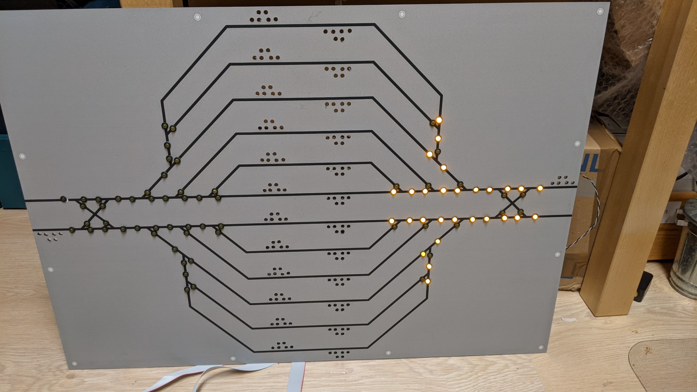
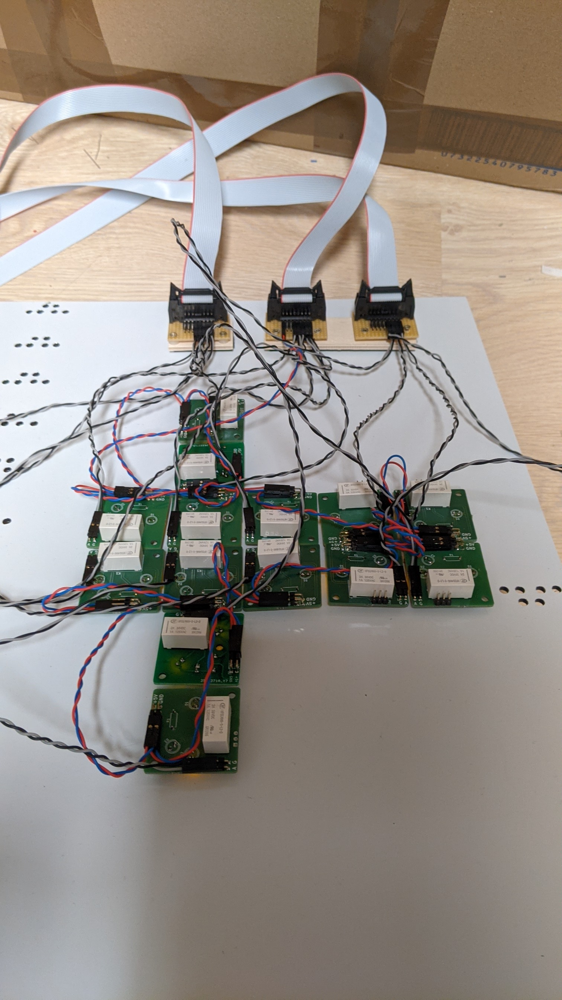
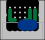
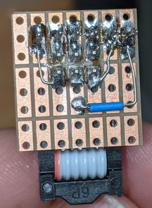
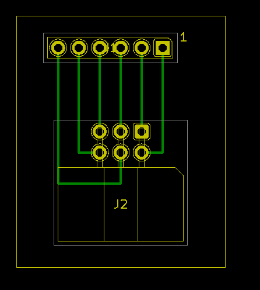

# Aktueller Stand (26.11.2021)

Kernstück des Ganzen sind die Weichendecoder für motorische Antriebe mit Impulssteuerung. Zum Einsatz sollen die Antriebe MP6 von MTB kommen. Diese werden mit kurzen Impulse gesteuert, indem der jeweilige Schalteingang kurz gegen Masse gezogen werden. Die Antriebe selbst werden mit 12V DC betrieben und haben auch gleich die Herzstückpolaristaion an Bord.

Geschaltet werden die Schaltausgänge 
* via CAN-BUS (und eigennem Protokoll)
* DCC
* oder für Testzwecke via USB-Console

CAN-BUS, DCC und auch 12V für die Versorgung der eigentlichen Eletronik erfolgt via einem RJ45-Netzwerkkarbel.

Für Testzwecke gibt es auch eine kleine CAN-BUS-Zentrale  

Über die Eingabe von einer "Adresse" können die einzelnen Schaltausgänge geschaltet werden. Auch das Schalten von Weichenstraße ist möglich.

Später soll das Ganze durch ein Stellpul mit Schaltern (und LEDs zur Anzeige) ersetzt werden.

Natürlich kann man die Ausgänge auch mit einer gewöhnlichen DCC-Zentrale geschaltet werden. Hier als Beispiel kommt eine ECOS von ESU zu Einsatz, die auch ein Stellpult kennt.

Da aktuell die Anlage ca 120km steht, wurde ein Modellbahn-Simulator gebaut. Die Weichenantriebe sind durch Bistabile Relais nachgebildet und die LED stellen die aktuelle Lage der Weichen wieder.

# CAN-BUS-Frames

Die einzelnen Aktoren haben eine id im Wertebereich uint_16 (2byte)
## Aktor schalten

* Frame ID: 100
* data16: ID1 [, [ID2][, [ID3][, [ID4]]]]

Pro Frame können 4 Aktoren gleichzeit geschaltet werden

## Status der Aktoren

* Frame ID 300
* data16: ID des Aktor, Status des Aktors, unbenutz, ID des aktiven Aktors

### Bedeutung der Status

* OFF 0x00
* ON  0x01
* RUNNING 0x02
* BLOCKED_STATE 0x03
* UNKNOWN_STATE 0x04

Eine einfache Weiche besteht aus zwei Aktoren. Um den Status dieser Weiche zu erhalten, werden zwei Frames gesendet.

Hat der eine Aktor einen Status RUNNING, so hat der zweite Aktor einen Status von BLOCKED_STATE, da dieser aktuell nicht verändert werden kann. 

# Adapter Wannenstecker 2x3 zu Stiftleiste 1x6

## Adapter auf Lochrasterplatte, Ansicht von unten.

## Leiterplatte, Blick von oben auf die Bestückungsseite

## Belegung der 1x6-Stiftleiste, Blick von oben auf die Leiterplatte

6  |  5 |  4 |  3 | 2  | 1 
---|----|----|----|----|---
r1 | r2 | gr |  + | ge | w  

## Belegung des 2x3-Wannensteckers 

5  | 6  | 1  
---|----|----
r2 | r1 | w  
gr | +  | ge 
4  | 3  | 2  